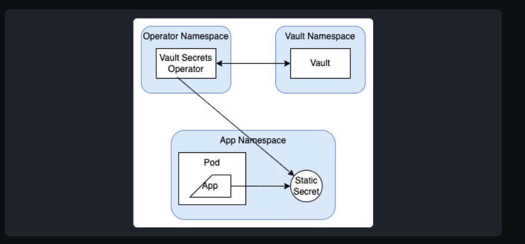

# Vault secrets operator 
+ The Vault Secrets Operator is a Kubernetes operator that syncs secrets between Vault and Kubernetes natively without requiring the users to learn details of Vault use.
+ Vault secrets operator allows pods to consume vault secrets natively from kubernetes secrets.
+ it allows pods to get secrets direct from vault through kubernetes secrets 


### Features of VSO
+ it supports syncing from ,multiple secret sources to vault
+ automatic secret drift detection  and remediation 
+ automatic secret rotation for Deployment,ReplicaSet,StatefuSet

### secret sources 
+ it supports multiple secret sources 
  + static and dynamic 
  + databases credentials 
  + pki certificates 

### practicals    

1. we need to have kubernetes cluster 
2. we need to add vso and hasicorp repo 
```
### via helm charts 
helm repo add hashicorp https://helm.releases.hashicorp.com

### we update the helm charts 
helm repo update

### we check if its installed 
helm search repo hashicorp/vault


```

3. we enable the auth method 
```
### at the path we would like 
vault auth enable -path demo-auth-mount kubernetes

### we configure the auth to know where kubernetes is 
vault write auth/demo-auth-mount/config \
   kubernetes_host="https://$KUBERNETES_PORT_443_TCP_ADDR:443"

```

4. we enable a secrets engine for testing 
```
### we enable kv engine 
vault secrets enable -path=kvv2 kv-v2

### we create a path that allows us to be able to read the secrets 
tee webapp.json <<EOF
path "kvv2/data/webapp/config" {
   capabilities = ["read", "list"]
}
EOF

### we write the policy to vault 
vault policy write webapp webapp.json
```

###
