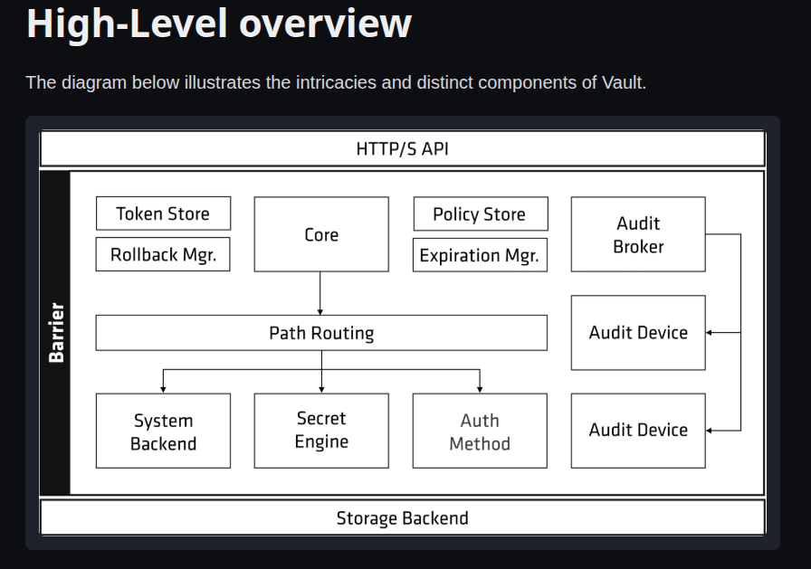

# Vault architecture
+ Has a lot of components that run along with it  and its an intricate system 
### diagram of data levels in vault 

+ vault encryption layer which is also known as the barrier , it encrypts and decrypts data. 
+ vault stores data in the storage backend. which makes it available for the vault server when it restarts and it provides persistent data for vault.
  + since data is stored outside the vault barrier , the barrier encrypts the data that is stored in the `storage backend` so that even if we had an attacker towards the backend the data wouldn't be compromised because they would find encrypted data. 

### Vault instance 
+ when vault instance is started , it begin in a sealed state, where all the data is encrypted. we can unseal vault with the `shamir secret sharing keys`.
+ when the shamir secret sharing keys are provided, vault decrypts the data and clients can access vault 

#### Client --> auth --> access to vault 

1. A client firstly authenticates with vault through the auth methods in vault ( userpass, kubernetes, tokens etc)
2. once the client has authenticated with vault, vault looks up the method and loads the polices attached to it. 
3. when everything is verified vault grants access to the client , it grants them access according to the polices attached to the auth methods.

#### Basically the Core Architectural Components
+ storage backend
+ secrets engine
+ auth methods
+ Audit devices 

#### The Lifecycle of a Request: A Step-by-Step Flow
When you interact with Vault (e.g., vault kv get secret/my-password), this is what happens under the hood:

1. Authenticate: The client provides its token. The Core sends this token to the Auth Method (like the token store), which validates it and returns the associated policies.

2. Authorize: The Core takes those policies and verifies that they explicitly grant access to the requested path (secret/data/my-password) and operation (read). Vault operates on a default-deny model; access must be explicitly granted.

3. Route: The request is routed to the appropriate Secrets Engine (in this case, the kv engine) mounted at the secret/ path.

4. Generate/Retrieve Secret: The kv engine fetches the secret from the Storage Backend. Because the data is encrypted at rest, it must be decrypted by the Barrier before being returned.

5. Manage Lease: If the returned data is a secret (and not just configuration), the Core registers it with the Expiration Manager, which creates a lease with a defined Time To Live (TTL). The client receives both the secret and a lease ID.

6. Audit: Before the response is sent back to the client, the Core sends a log of the request and response to the Audit Broker, which writes it to all configured Audit Devices.

Understanding this architecture is key to effectively using and operating Vault. The specific questions you've been asking about listing paths in the database/ and transit/ engines are direct interactions with the Secrets Engines component.

I hope this provides a clear high-level picture. Is there a specific component, like the seal/unseal process or how policies are structured, that you'd like to explore in more detail?

This response is AI-generated, for reference only.
