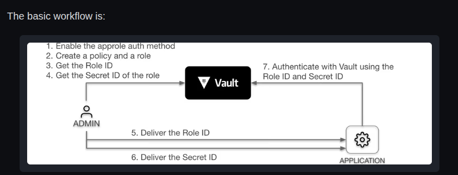
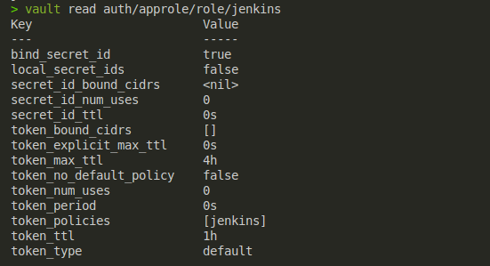

# Vault 
+ Vault is a tool that is used to store sensitive data and it is the secret management for mission-critical data whether you deploy systems on-premises, in the cloud, or in a hybrid environment.
### Why should I use Vault
+ vault helps to  harden applications by centralizing secrets management 
 + Manage static secrets
 + Manage certificates
 + Manage identities and authentication
 + Manage 3rd-party secrets
 + Manage sensitive data
 + Support regulatory compliance

### What is a plugin
+ plugins act as building blocks in vault lets us control how data moves through the environment and who can access it:
  + authentication plugins 
  + general secret plugins that generate, store, manage, or transform sensitive information.
  + database secret plugins that manage dynamic credentials that clients use to access database data.


### where does vault store data 
+ integrated - inbuilt( Raft ) which has HA and provides backup/restore capabilities.
+ fileSystems - vault store on the local path which doesn't have HA 
+ in memory - vault stores the data in memory which is mostly used in dev mode.
+ external - which can be AWS,Azure,Google cloud, MySql etc 


## Authentication

### Auth methods 
+ these are components in vault that are responsible to identifying the person or machine who's authenticating  with vault and they have the access to vault according to the policies attached to the token 
+ when the auth method that was created gets deleted all the people who had access via that method it gets deleted as well 

### Enabling the userpass  
```
## Enable the Userpass Auth Method
vault auth enable userpass

### to use a different path 
vault auth enable -path=myuserpass userpass

## Create a User 
vault write auth/userpass/users/<username> \
    password=<password> \
    policies=<policy-name>

### example 
vault write auth/userpass/users/john \
    password=mySecurePass123 \
    policies=default

### example 2 adding TTL
vault write auth/userpass/users/john \
    password=mySecurePass123 \
    policies=default \
    token_ttl=1h \
    token_max_ttl=8h

### Verify the User
# List all users
vault list auth/userpass/users

# Read details of a specific user
vault read auth/userpass/users/john

## Authenticate
vault login -method=userpass username=john
```
## Tokens
+ tokens are the core of aunthntication in vault, tokens can be used directly with auth methods.
+ `vault opeator init` is the only method that can not be disabled and as its the first auth method 
 + The rest of the tokens that are created they all have the same properties 
+ within vault tokens have access to the cluster according to the policies attached to them.

## Token store 
+ auth authentication backed its responsible for creating and storing tokens and can't be disabled. it is the only method that has no login capabilities 

### Token types 
+ there are two types of tokens
  + Batch - these are tokens that carry enough information to be used by vault actions and they don't have the features in service tokens 
  + Service -  these are tokens with many features such as renewal revoking and can create children. we can also track them 

Root tokens 
These are tokens with root capabilities and have the root police. they can do anything in  vault and don't have TTL. we can create root tokens in three ways 
+ via the inistial `vault operator init`
+ by using another root token , a root token with an expiration date can't create a root token that nerver expires 
+ by using `vault operator generate-root`
```
# vault operator geneeate-root

```

### Generate tokens for machine authentication with AppRole
+ AppRole- method is the type of auth that is used by apps to authenticate with vault ( or machines ) 
+ it uses RoleID and SecretID for login 
the workflow 


```
### enabling AppRole auth 
> vault auth enable approle 

we create the policy that will allow the approle to have the required permissions 
> vault policy write jenkins -<<EOF
# Read-only permission on secrets stored at 'secret/data/mysql/webapp'
path "secret/data/mysql/webapp" {
  capabilities = [ "read" ]
}
EOF

we create role name jenkis with TTL and the we attach the police we just created 

> vault write auth/approle/role/jenkins token_policies="jenkins" \
    token_ttl=1h token_max_ttl=4h

if we want to use multi policies we use a comma to separete the policies 
+ token_policies="jenkins,anotherpolicy"

# to read approle 
> vault read auth/approle/role/jenkins 


# To create new approles syntax 
> vault write auth/approle/role/<ROLE_NAME> [parameters]
```
#### Get RoleID and SecretID
+ The RoleID and SecretID are like username and password that an app uses 
we can get them through these endpoints 
+ vault read `auth/approle/role/<ROLE_NAME>/role-id`
we can generate the secret-id with 
+ vault write -f  `auth/approle/role/<ROLE_NAME>/secret-id`

+ The `RoleID` is like a username which means every role has the same RoleID
+ `SecretID` behaves like a password that Vault will generate a new value every time you request it.

#### Log in with RoleID & SecretID
+ we use the login endpoint `auth/approle/login`

> vault write auth/approle/login role_id="e6fe9757-09e3-6b83-ef14-1d7730a97ac3" \
    secret_id="2b34afd9-c48f-5e20-5e31-76e18677dd54"
after login vault returns the details of the role 

#### Read secrets using the AppRole token 
+ we can use the token from the role which vault gives us after login 
+ export APP_TOKEN="token_here "

we can verify by accessing the secret we created
+ `VAULT_TOKEN=$APP_TOKEN vault kv get secret/mysql/webapp`

 we only have read access according to our policy if we try to delete it it fails we get the permission denial 
+ `VAULT_TOKEN=$APP_TOKEN vault kv delete secret/mysql/webapp` 

#### Limit the SecretID usages
+ we can limit the number of users who can use the secretID 
> vault write auth/approle/role/jenkins token_policies="jenkins" \
     token_ttl=1h token_max_ttl=4h \
     secret_id_num_uses=10

After reaching the set number of uses, the SecretID expires and you would need to generate a new one. This is like forcing a password rotation

