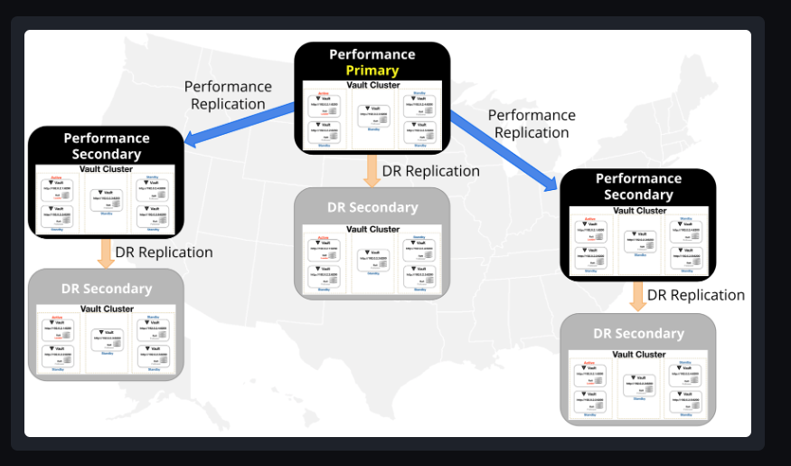
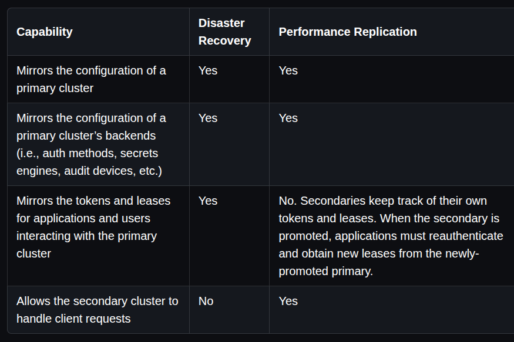

# Disaster- recovery and replication
+ Vault replication helps us in disaster recovery and provided high availability when the demand increases. 
+ using vault replications requires a storage backend that supports transactional updates such as integrated storage or consul 
## Architecture 
+ the replication of vault is called a cluster that consist vault nodes.
+ The communications between the nodes is end to end encrypted with TLS and a token that was exchanged during bootstrapping the nodes 
+ The replication model operates on a leader/follower model 
  + where a leader is known as the primary ( the primary cluster acts as the system of records asynchronously replicates most vault data )
  + and the follower is known as the secondary 
## Replication of data
+ it depends with the type of replication that is configured between primary and the secondary. 
+ the types of replication can either be disaster recovery and performance replication.

types 

### Performance replication 
+ it allows secondaries to keep track of their own tokens and leases but share the policies , and supporting secretes engines ( kv, encrpted keys for transit  )
+ if a user would request for data that is available in primary nodes the secondary redirects the clients to primary nodes 
+ we can also use path filters to filter out the information that we wouldn't like to be replicated by secondaries.

### Disaster recovery replication 
+ in disaster replication the secondary shares the same configurations as the primary,since the main purpose of having a DR replication is for them to be used when there is a catastrophe to the cluster and we can use them for recovery. 
+ 