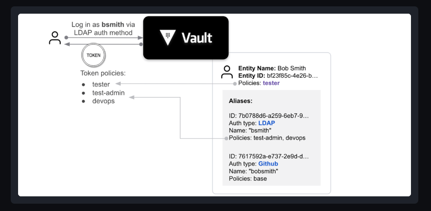

# Identity 
The main purpose of identity is for vault to be able to recognized its clients. and it has `Identity secrets engine`. 

## Entities and aliases
+ `Entity` in vault is a representation of a client that authenticates in vault ( human or machine  ). they are stored in `Identity secrets engine` by default. the identity secrets engine can't be moved or disabled its mounted by default.

+ Alias is a link between an Entity and a specific authentication method account. one entity can have multiple alias but can not have multiple alias for the same auth method. 

+ when a clients authenticates via any credential backend vault creates an entity and attaches an alias if it doesn't exist. ( except the token backend )

## Entity policies
+  entities can be assigned polices which adds permission to the polices associated with the token backend. 
+  since the polices they are evaluated when they are being executed. 

## Implicit entities
Operators can create entities for all the users of an auth mount beforehand and assign policies to them, so that when users login, the desired capabilities to the tokens via entities are already assigned. But if that's not done, upon a successful user login from any of the authentication backends, Vault will create a new entity and assign an alias against the login that was successful.

Note that the tokens created using the token authentication backend will not normally have any associated identity information. An existing or new implicit entity can be assigned by using the entity_alias parameter, when creating a token using a token role with a configured list of allowed_entity_aliases.

### Identity auditing
+ if a token that was used to login has an entity vault save it log and trails of actions which where performed by the user 

### Identity groups
vault identity supports group management. Entities in a group have the polices of the group. groups helps us to sort multi users that must have the same polices, we just have them in  a group which grants them the required polices 

### External vs internal groups
+ groups that are created in the identity store they are called internal groups.
+ external groups are created outside of the identity store